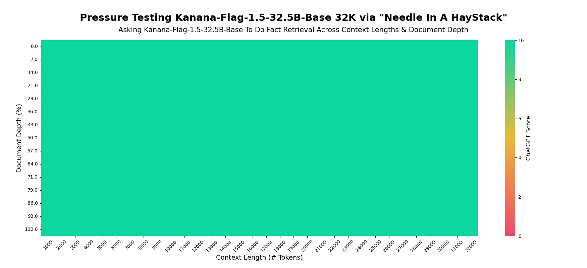
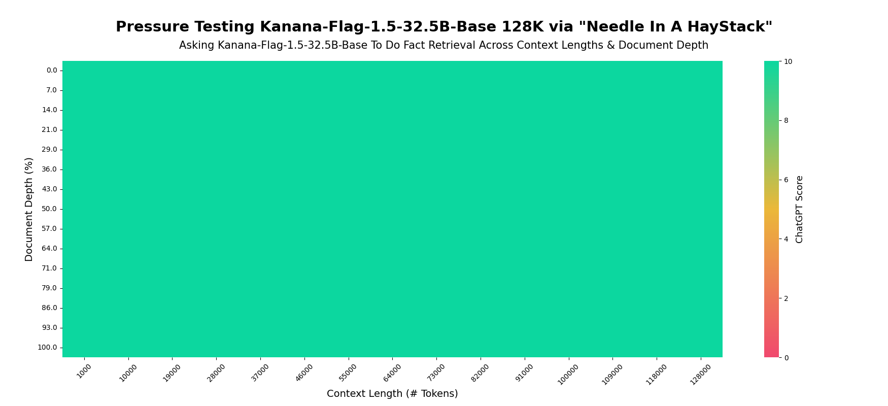
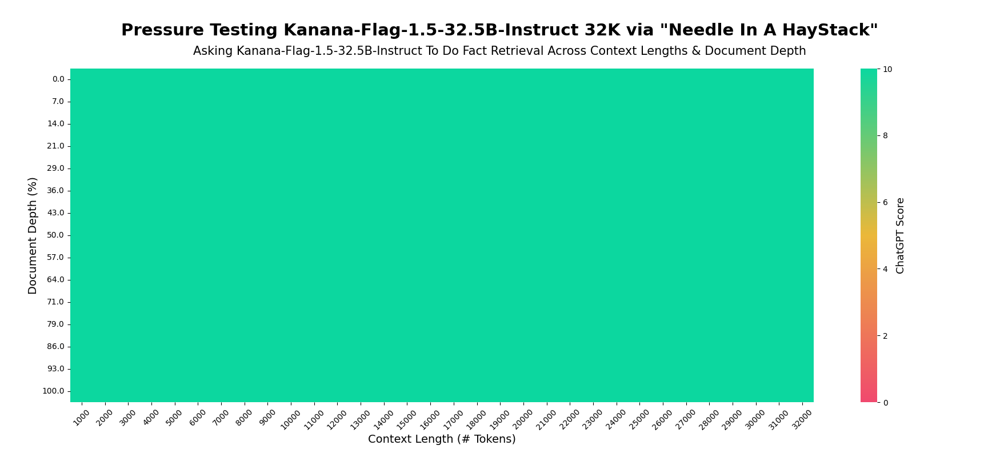
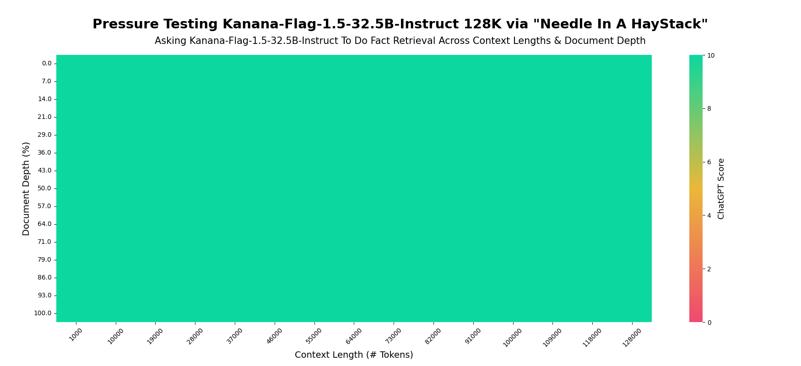
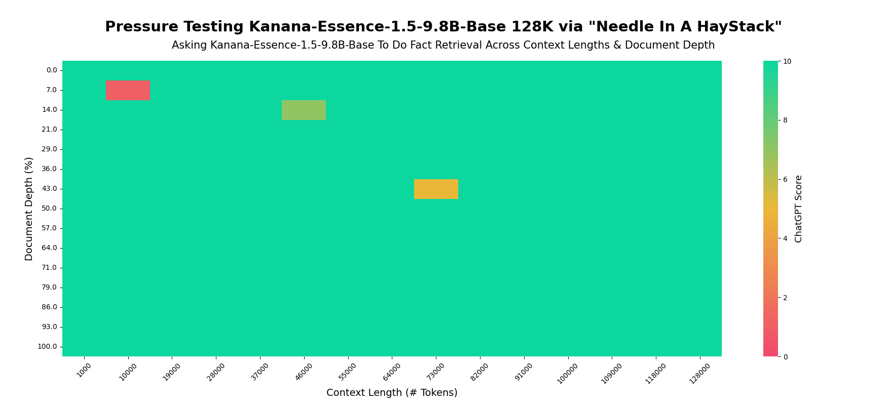
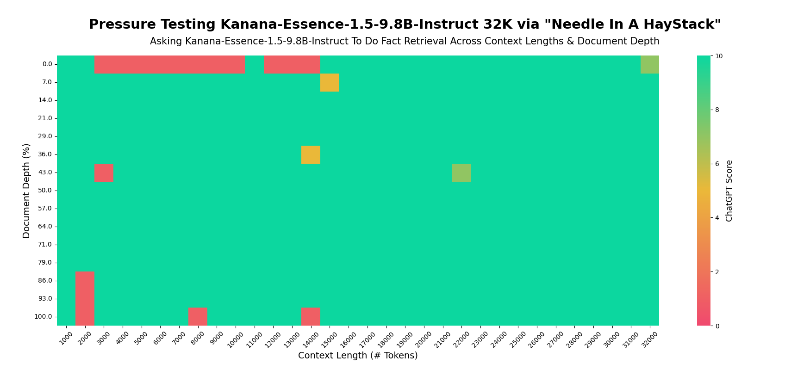
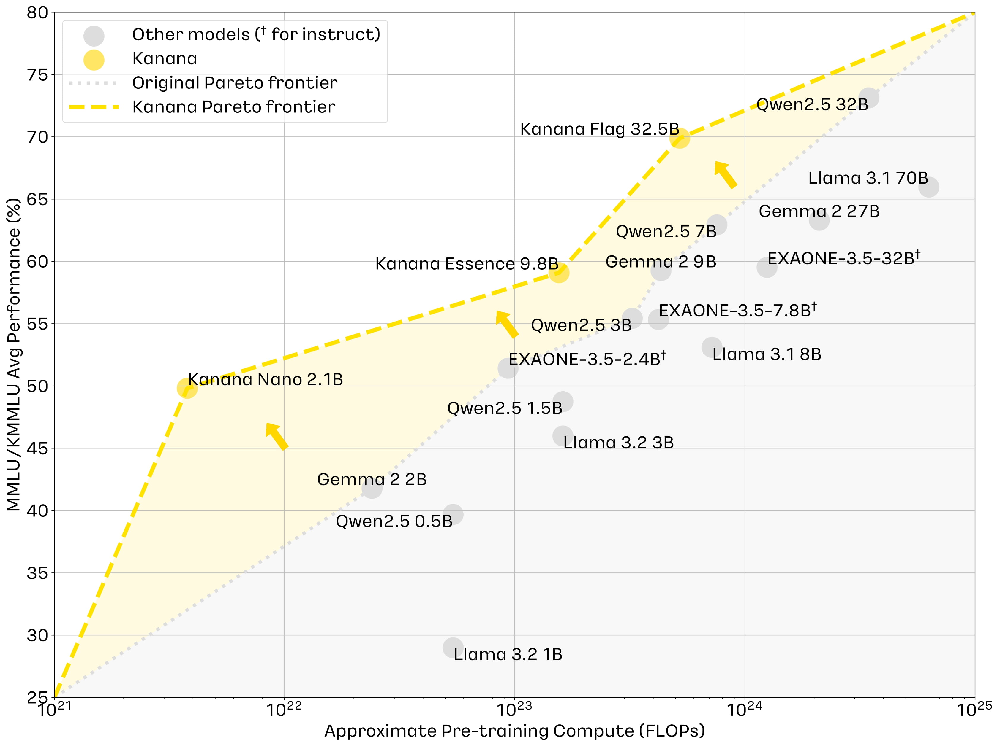

<p align="center">
<br>
    <picture>
        <source media="(prefers-color-scheme: dark)" srcset="assets/logo/kanana-logo-light.png">
        <source media="(prefers-color-scheme: light)" srcset="assets/logo/kanana-logo-dark.png">
        
    </picture>
</br>
<p align="center">
🤗 <a href="https://kko.kakao.com/kananallm">1.5 HF Models</a> &nbsp |
&nbsp 📕 <a href="https://tech.kakao.com/posts/707">1.5 Blog</a> &nbsp |
&nbsp 📜 <a href="https://arxiv.org/abs/2502.18934">Technical Report</a>


<br>

## News 🔥

- ✨`2025/05/23`: Published a [blog post](https://tech.kakao.com/posts/707) about `Kanana 1.5` models and released 🤗[HF model weights](https://kko.kakao.com/kananallm).
- 📜`2025/02/27`: Released [Technical Report](https://arxiv.org/abs/2502.18934) and 🤗[HF model weights](https://huggingface.co/collections/kakaocorp/kanana-nano-21b-67a326cda1c449c8d4172259).
- 📕`2025/01/10`: Published a [blog post](https://tech.kakao.com/posts/682) about the development of `Kanana Nano` model.
- 📕`2024/11/14`: Published blog posts ([pre-training](https://tech.kakao.com/posts/661), [post-training](https://tech.kakao.com/posts/662)) about the development of `Kanana` models.
- ▶️`2024/11/06`: Published a [presentation video](https://youtu.be/HTBl142x9GI?si=o_we6t9suYK8DfX3) about the development of the `Kanana` models.

<br>

## Table of Contents

- [Kanana 1.5](#kanana-15)
    - [Performance](#performance)
        - [Base Model Evaluation](#base-model-evaluation)
        - [Instruct Model Evaluation](#instruct-model-evaluation)
        - [Long Context](#long-context)
    - [Processing 32K+ Length](#processing-32k-length)
    - [Contributors](#contributors)
- [Kanana 1.0](#kanana-10)
- [Citation](#citation)
- [Contact](#contact)

<br>

# Kanana 1.5

`Kanana 1.5`, a newly introduced version of the Kanana model family, presents substantial enhancements in **coding, mathematics, and function calling capabilities** over the previous version, enabling broader application to more complex real-world problems. This new version now can handle __up to 32K tokens length natively and up to 128K tokens using YaRN__, allowing the model to maintain coherence when handling extensive documents or engaging in extended conversations. Furthermore, Kanana 1.5 delivers more natural and accurate conversations through a __refined post-training process__.

<!-- <p align="center">
<picture>
    
</picture> -->

> [!Note]
> Neither the pre-training nor the post-training data includes Kakao user data.

## Performance

### Base Model Evaluation
<table>
    <tr>
        <th>Models</th>
        <th>MMLU</th>
        <th>KMMLU</th>
        <th>HAERAE</th>
        <th>HumanEval</th>
        <th>MBPP</th>
        <th>GSM8K</th>
    </tr>
    <tr>
        <td><strong>Kanana-Flag-1.5-32.5B</strong></td>
        <td align="center">76.76</td>
        <td align="center">61.90</td>
        <td align="center">89.18</td>
        <td align="center">73.17</td>
        <td align="center">65.60</td>
        <td align="center">81.50</td>
    </tr>
    <tr>
        <td><strong>Kanana-Flag-32.5B</strong></td>
        <td align="center">77.68</td>
        <td align="center">62.10</td>
        <td align="center">90.47</td>
        <td align="center">51.22</td>
        <td align="center">63.40</td>
        <td align="center">70.05</td>
    </tr>
    <tr>
        <td><strong>Kanana-Essence-1.5-9.8B</strong></td>
        <td align="center">68.27</td>
        <td align="center">52.78</td>
        <td align="center">86.34</td>
        <td align="center">64.63</td>
        <td align="center">61.60</td>
        <td align="center">71.57</td>
    </tr>
    <tr>
        <td><strong>Kanana-Essence-9.8B</strong></td>
        <td align="center">67.61</td>
        <td align="center">50.57</td>
        <td align="center">84.97</td>
        <td align="center">40.24</td>
        <td align="center">53.60</td>
        <td align="center">63.61</td>
    </tr>
    <!-- <tr>
        <td><strong>Kanana-1.5-8B</strong></td>
        <td align="center">64.24</td>
        <td align="center">48.94</td>
        <td align="center">82.77</td>
        <td align="center">61.59</td>
        <td align="center">57.80</td>
        <td align="center">63.53</td>
    </tr>
    <tr>
        <td><strong>Kanana-8B</strong></td>
        <td align="center">64.22</td>
        <td align="center">48.30</td>
        <td align="center">83.41</td>
        <td align="center">40.24</td>
        <td align="center">51.40</td>
        <td align="center">57.09</td>
    </tr> -->
    <tr>
        <td><strong>Kanana-Nano-1.5-3B</strong></td>
        <td align="center">59.23</td>
        <td align="center">47.30</td>
        <td align="center">78.00</td>
        <td align="center">46.34</td>
        <td align="center">46.80</td>
        <td align="center">61.79</td>
    </tr>
    <!-- <tr>
        <td><strong>Kanana-1.5-2.1B</strong></td>
        <td align="center">56.30</td>
        <td align="center">45.10</td>
        <td align="center">77.46</td>
        <td align="center">52.44</td>
        <td align="center">47.00</td>
        <td align="center">55.95</td>
    </tr> -->
    <tr>
        <td><strong>Kanana-Nano-2.1B</strong></td>
        <td align="center">54.83</td>
        <td align="center">44.80</td>
        <td align="center">77.09</td>
        <td align="center">31.10</td>
        <td align="center">46.20</td>
        <td align="center">46.32</td>
    </tr>
</table>

#### Open-source Base Model Evaluation
<table>
    <tr>
        <th>Models</th>
        <th>MMLU</th>
        <th>KMMLU</th>
        <th>HAERAE</th>
        <th>HumanEval</th>
        <th>MBPP</th>
        <th>GSM8K</th>
    </tr>
    <tr>
        <td><strong>Kanana-1.5-8B</strong></td>
        <td align="center">64.24</td>
        <td align="center">48.94</td>
        <td align="center">82.77</td>
        <td align="center">61.59</td>
        <td align="center">57.80</td>
        <td align="center">63.53</td>
    </tr>
    <tr>
        <td><strong>Kanana-8B*</strong></td>
        <td align="center">64.22</td>
        <td align="center">48.30</td>
        <td align="center">83.41</td>
        <td align="center">40.24</td>
        <td align="center">51.40</td>
        <td align="center">57.09</td>
    </tr>
    <tr>
        <td><strong>Kanana-1.5-2.1B</strong></td>
        <td align="center">56.30</td>
        <td align="center">45.10</td>
        <td align="center">77.46</td>
        <td align="center">52.44</td>
        <td align="center">47.00</td>
        <td align="center">55.95</td>
    </tr>
    <tr>
        <td><strong>Kanana-Nano-2.1B</strong></td>
        <td align="center">54.83</td>
        <td align="center">44.80</td>
        <td align="center">77.09</td>
        <td align="center">31.10</td>
        <td align="center">46.20</td>
        <td align="center">46.32</td>
    </tr>
</table>

> \* This model is not an open-sourced, just for comparison with Kanana-1.5-8B

<br>

### Instruct Model Evaluation
<table>
    <tr>
        <th>Models</th>
        <th>MT-Bench</th>
        <th>KoMT-Bench</th>
        <th>IFEval</th>
        <th>HumanEval+</th>
        <th>MBPP+</th>
        <th>GSM8K (0-shot)</th>
        <th>MATH</th>
        <th>MMLU (0-shot, CoT)</th>
        <th>KMMLU (0-shot, CoT)</th>
        <th>FunctionChatBench</th>
    </tr>
    <tr>
        <td><strong>Kanana-Flag-1.5-32.5B</strong></td>
        <td align="center">8.13</td>
        <td align="center">8.12</td>
        <td align="center">82.70</td>
        <td align="center">79.88</td>
        <td align="center">71.96</td>
        <td align="center">93.03</td>
        <td align="center">75.96</td>
        <td align="center">82.76</td>
        <td align="center">64.10</td>
        <td align="center">67.17</td>
    </tr>
    <tr>
        <td><strong>Kanana-Flag-32.5B</strong></td>
        <td align="center">8.33</td>
        <td align="center">8.03</td>
        <td align="center">84.59</td>
        <td align="center">78.66</td>
        <td align="center">69.84</td>
        <td align="center">91.66</td>
        <td align="center">58.08</td>
        <td align="center">81.08</td>
        <td align="center">64.19</td>
        <td align="center">65.67</td>
    </tr>
    <tr>
        <td><strong>Kanana-Essence-1.5-9.8B</strong></td>
        <td align="center">7.88</td>
        <td align="center">7.35</td>
        <td align="center">76.34</td>
        <td align="center">72.56</td>
        <td align="center">66.93</td>
        <td align="center">90.07</td>
        <td align="center">62.02</td>
        <td align="center">72.85</td>
        <td align="center">52.00</td>
        <td align="center">51.43</td>
    </tr>
    <tr>
        <td><strong>Kanana-Essence-9.8B</strong></td>
        <td align="center">7.81</td>
        <td align="center">7.65</td>
        <td align="center">80.20</td>
        <td align="center">72.56</td>
        <td align="center">68.52</td>
        <td align="center">84.91</td>
        <td align="center">42.24</td>
        <td align="center">70.64</td>
        <td align="center">50.76</td>
        <td align="center">26.77</td>
    </tr>
    <!-- <tr>
        <td><strong>Kanana-1.5-8B*</strong></td>
        <td align="center">7.76</td>
        <td align="center">7.63</td>
        <td align="center">80.11</td>
        <td align="center">76.83</td>
        <td align="center">67.99</td>
        <td align="center">87.64</td>
        <td align="center">67.54</td>
        <td align="center">68.82</td>
        <td align="center">48.28</td>
        <td align="center">58.00</td>
    </tr>
    <tr>
        <td><strong>Kanana-8B</strong></td>
        <td align="center">7.13</td>
        <td align="center">6.92</td>
        <td align="center">76.91</td>
        <td align="center">62.20</td>
        <td align="center">43.92</td>
        <td align="center">79.23</td>
        <td align="center">37.68</td>
        <td align="center">66.50</td>
        <td align="center">47.43</td>
        <td align="center">17.37</td>
    </tr> -->
    <tr>
        <td><strong>Kanana-Nano-1.5-3B</strong></td>
        <td align="center">7.01</td>
        <td align="center">6.52</td>
        <td align="center">70.08</td>
        <td align="center">70.73</td>
        <td align="center">64.29</td>
        <td align="center">80.36</td>
        <td align="center">56.70</td>
        <td align="center">59.69</td>
        <td align="center">37.60</td>
        <td align="center">55.37</td>
    </tr>
    <!-- <tr>
        <td><strong>Kanana-1.5-2.1B*</strong></td>
        <td align="center">7.01</td>
        <td align="center">6.54</td>
        <td align="center">68.61</td>
        <td align="center">68.90</td>
        <td align="center">65.08</td>
        <td align="center">81.43</td>
        <td align="center">60.62</td>
        <td align="center">53.87</td>
        <td align="center">32.93</td>
        <td align="center">53.70</td>
    </tr> -->
    <tr>
        <td><strong>Kanana-Nano-2.1B</strong></td>
        <td align="center">6.40</td>
        <td align="center">5.90</td>
        <td align="center">71.97</td>
        <td align="center">63.41</td>
        <td align="center">62.43</td>
        <td align="center">72.32</td>
        <td align="center">29.26</td>
        <td align="center">52.48</td>
        <td align="center">38.51</td>
        <td align="center">26.10</td>
    </tr>
</table>

#### Open-source Instruct Model Evaluation
<table>
    <tr>
        <th>Models</th>
        <th>MT-Bench</th>
        <th>KoMT-Bench</th>
        <th>IFEval</th>
        <th>HumanEval+</th>
        <th>MBPP+</th>
        <th>GSM8K (0-shot)</th>
        <th>MATH</th>
        <th>MMLU (0-shot, CoT)</th>
        <th>KMMLU (0-shot, CoT)</th>
        <th>FunctionChatBench</th>
    </tr>
    <tr>
        <td><strong>Kanana-1.5-8B†</strong></td>
        <td align="center">7.76</td>
        <td align="center">7.63</td>
        <td align="center">80.11</td>
        <td align="center">76.83</td>
        <td align="center">67.99</td>
        <td align="center">87.64</td>
        <td align="center">67.54</td>
        <td align="center">68.82</td>
        <td align="center">48.28</td>
        <td align="center">58.00</td>
    </tr>
    <tr>
        <td><strong>Kanana-8B*</strong></td>
        <td align="center">7.13</td>
        <td align="center">6.92</td>
        <td align="center">76.91</td>
        <td align="center">62.20</td>
        <td align="center">43.92</td>
        <td align="center">79.23</td>
        <td align="center">37.68</td>
        <td align="center">66.50</td>
        <td align="center">47.43</td>
        <td align="center">17.37</td>
    </tr>
    <tr>
        <td><strong>Kanana-1.5-2.1B†</strong></td>
        <td align="center">7.01</td>
        <td align="center">6.54</td>
        <td align="center">68.61</td>
        <td align="center">68.90</td>
        <td align="center">65.08</td>
        <td align="center">81.43</td>
        <td align="center">60.62</td>
        <td align="center">53.87</td>
        <td align="center">32.93</td>
        <td align="center">53.70</td>
    </tr>
    <tr>
        <td><strong>Kanana-Nano-2.1B</strong></td>
        <td align="center">6.40</td>
        <td align="center">5.90</td>
        <td align="center">71.97</td>
        <td align="center">63.41</td>
        <td align="center">62.43</td>
        <td align="center">72.32</td>
        <td align="center">29.26</td>
        <td align="center">52.48</td>
        <td align="center">38.51</td>
        <td align="center">26.10</td>
    </tr>
</table>

> † Models released under Apache 2.0 are trained on the latest versions compared to other models.

> \* This model is not an open-sourced, just for comparison with Kanana-1.5-8B

<br>

### Long Context
The current approach we use for extending context length has limitations when applied to models with fewer parameters(~3B). We are therefore refining this approach and intend to implement it across all models going forward soon.

<details>
<summary>Kanana-Flag-1.5-32.5B</summary>

#### Kanana-Flag-1.5-32.5B-Base
Below is a Needle-in-a-Haystack performance of `Kanana-Flag-1.5-32.5B-Base` model which was trained on a target context length of 32K.
- (top): evaluated with native 32K context length
- (bottom): extended to 128K context length using YaRN

<p align="center">
<picture>
    
</picture>

<p align="center">
<picture>
    
</picture>

#### Kanana-Flag-1.5-32.5B-Instruct
Below is a Needle-in-a-Haystack performance of `Kanana-Flag-1.5-32.5B-Instruct` model which was trained on a target context length of 32K.
- (top): evaluated with native 32K context length
- (bottom): extended to 128K context length using YaRN

<p align="center">
<picture>
    
</picture>

<p align="center">
<picture>
    
</picture>

</details>

<details>
<summary>Kanana-Essence-1.5-9.8B</summary>

#### Kanana-Essence-1.5-9.8B-Base
Below is a Needle-in-a-Haystack performance of `Kanana-Essence-1.5-9.8B-Base` model which was trained on a target context length of 32K.
- (top): evaluated with native 32K context length
- (bottom): extended to 128K context length using YaRN

<p align="center">
<picture>
    
</picture>

<p align="center">
<picture>
    
</picture>

#### Kanana-Essence-1.5-9.8B-Instruct
Below is a Needle-in-a-Haystack performance of `Kanana-Essence-1.5-9.8B-Instruct` model which was trained on a target context length of 32K.
- (top): evaluated with native 32K context length
- (bottom): extended to 128K context length using YaRN

<p align="center">
<picture>
    
</picture>

<p align="center">
<picture>
    
</picture>

</details>

> [!Note]
> Other models to be updated soon

<br>

## Processing 32K+ Length
Currently, the `config.json` uploaded to HuggingFace is configured for token lengths of 32,768 or less. To process tokens beyond this length, YaRN must be applied. By updating the `config.json` with the following parameters, you can apply YaRN to handle token sequences up to 128K in length:
```json
"rope_scaling": {
    "factor": 4.4,
    "original_max_position_embeddings": 32768,
    "type": "yarn",
    "beta_fast": 64,
    "beta_slow": 2
},
```

<br>

## Contributors
- Language Model Training: Yunju Bak, Doohae Jung, Boseop Kim, Nayeon Kim, Hojin Lee, Jaesun Park, Minho Ryu
- Language Model Alignment: Jiyeon Ham, Seungjae Jung, Hyunho Kim, Hyunwoong Ko, Changmin Lee, Daniel Wontae Nam
- AI Engineering: Youmin Kim, Hyeongju Kim

<br>

# Kanana 1.0
<details>
<summary>View the details about Kanana 1.0</summary>

<br>

We introduce Kanana, a series of bilingual language models (developed by [Kakao](https://github.com/kakao)) that demonstrate exceeding performance in Korean and competitive performance in English. The computational cost of Kanana is significantly lower than that of state-of-the-art models of similar size. The report details the techniques employed during pre-training to achieve compute-efficient yet competitive models, including high-quality data filtering, staged pre-training, depth up-scaling, and pruning and distillation. Furthermore, the report outlines the methodologies utilized during the post-training of the Kanana models, encompassing supervised fine-tuning and preference optimization, aimed at enhancing their capability for seamless interaction with users. Lastly, the report elaborates on plausible approaches used for language model adaptation to specific scenarios, such as embedding, function calling, and Retrieval Augmented Generation (RAG). The Kanana model series spans from 2.1B to 32.5B parameters with 2.1B models (base, instruct, embedding, function call, and RAG) publicly released to promote research on Korean language models.

> Neither the pre-training nor the post-training data includes Kakao user data.

<p align="center">
<picture>
    
</picture>

## Performance

Below are partial report on the performance of the `Kanana` model series. Please refer to the [Technical Report](https://arxiv.org/abs/2502.18934) for the full results.

### Base Model Evaluation

<table>
    <tr>
        <th>Models</th>
        <th>MMLU</th>
        <th>KMMLU</th>
        <th>HAERAE</th>
        <th>HumanEval</th>
        <th>MBPP</th>
        <th>GSM8K</th>
    </tr>
    <tr>
        <th colspan="8" height="30px">27b+ scale</th>
    </tr>
    <tr>
        <td>Kanana-Flag-32.5b</td>
        <td align="center">77.68</td>
        <td align="center">62.10</td>
        <td align="center"><strong>90.47</strong></td>
        <td align="center"><strong>51.22</strong></td>
        <td align="center">63.40</td>
        <td align="center">70.05</td>
    </tr>
    <tr>
        <td>Qwen2.5-32b</td>
        <td align="center"><strong>83.10</strong></td>
        <td align="center"><strong>63.15</strong></td>
        <td align="center">75.16</td>
        <td align="center">50.00</td>
        <td align="center">73.40</td>
        <td align="center"><strong>82.41</strong></td>
    </tr>
    <tr>
        <td>Gemma-2-27b</td>
        <td align="center">75.45</td>
        <td align="center">51.16</td>
        <td align="center">69.11</td>
        <td align="center"><strong>51.22</strong></td>
        <td align="center">64.60</td>
        <td align="center">74.37</td>
    </tr>
    <tr>
        <td>EXAONE-3.5-32b</td>
        <td align="center">72.68</td>
        <td align="center">46.36</td>
        <td align="center">82.22</td>
        <td align="center">-</td>
        <td align="center">-</td>
        <td align="center">-</td>
    </tr>
    <tr>
        <td>Aya-Expanse-32b</td>
        <td align="center">74.52</td>
        <td align="center">49.57</td>
        <td align="center">80.66</td>
        <td align="center">-</td>
        <td align="center">-</td>
        <td align="center">-</td>
    </tr>
    <tr>
        <th colspan="8" height="30px">7b+ scale</th>
    </tr>
    <tr>
        <td>Kanana-Essence-9.8b</td>
        <td align="center">67.61</td>
        <td align="center">50.57</td>
        <td align="center"><strong>84.98</strong></td>
        <td align="center">40.24</td>
        <td align="center">53.60</td>
        <td align="center">63.61</td>
    </tr>
    <tr>
        <td>Llama-3.1-8b</td>
        <td align="center">65.18</td>
        <td align="center">41.02</td>
        <td align="center">61.78</td>
        <td align="center">35.37</td>
        <td align="center">48.60</td>
        <td align="center">50.87</td>
    </tr>
    <tr>
        <td>Qwen2.5-7b</td>
        <td align="center"><strong>74.19</strong></td>
        <td align="center"><strong>51.68</strong></td>
        <td align="center">67.46</td>
        <td align="center"><strong>56.71</strong></td>
        <td align="center"><strong>63.20</strong></td>
        <td align="center"><strong>83.85</strong></td>
    </tr>
    <tr>
        <td>Gemma-2-9b</td>
        <td align="center">70.34</td>
        <td align="center">48.18</td>
        <td align="center">66.18</td>
        <td align="center">37.20</td>
        <td align="center">53.60</td>
        <td align="center">68.16</td>
    </tr>
    <tr>
        <td>EXAONE-3.5-7.8b</td>
        <td align="center">65.36</td>
        <td align="center">45.30</td>
        <td align="center">77.54</td>
        <td align="center">-</td>
        <td align="center">-</td>
        <td align="center">-</td>
    </tr>
    <tr>
        <td>Aya-Expanse-8b</td>
        <td align="center">62.52</td>
        <td align="center">40.11</td>
        <td align="center">71.95</td>
        <td align="center">-</td>
        <td align="center">-</td>
        <td align="center">-</td>
    </tr>
    <tr>
        <th colspan="8" height="30px">2b+ scale</th>
    </tr>
    <tr>
        <td>Kanana-Nano-2.1b</td>
        <td align="center">54.83</td>
        <td align="center">44.80</td>
        <td align="center"><strong>77.09</strong></td>
        <td align="center">31.10</td>
        <td align="center">46.20</td>
        <td align="center">46.32</td>
    </tr>
    <tr>
        <td>Llama-3.2-3b</td>
        <td align="center">56.40</td>
        <td align="center">35.57</td>
        <td align="center">47.66</td>
        <td align="center">25.61</td>
        <td align="center">39.00</td>
        <td align="center">27.37</td>
    </tr>
    <tr>
        <td>Qwen2.5-3b</td>
        <td align="center"><strong>65.57</strong></td>
        <td align="center"><strong>45.28</strong></td>
        <td align="center">61.32</td>
        <td align="center"><strong>37.80</strong></td>
        <td align="center"><strong>55.60</strong></td>
        <td align="center"><strong>69.07</strong></td>
    </tr>
    <tr>
        <td>Gemma-2-2b</td>
        <td align="center">52.89</td>
        <td align="center">30.67</td>
        <td align="center">45.55</td>
        <td align="center">20.12</td>
        <td align="center">28.20</td>
        <td align="center">24.72</td>
    </tr>
    <tr>
        <td>EXAONE-3.5-2.4b</td>
        <td align="center">59.27</td>
        <td align="center">43.58</td>
        <td align="center">69.65</td>
        <td align="center">-</td>
        <td align="center">-</td>
        <td align="center">-</td>
    </tr>
    <tr>
        <th colspan="8" height="30px">70b+ scale</th>
    </tr>
    <tr>
        <td>Llama-3.1-70b</td>
        <td align="center">78.93</td>
        <td align="center">53.00</td>
        <td align="center">76.35</td>
        <td align="center">57.32</td>
        <td align="center">66.60</td>
        <td align="center">81.73</td>
    </tr>
    <tr>
        <td>Qwen2.5-72b</td>
        <td align="center">86.12</td>
        <td align="center">68.57</td>
        <td align="center">80.84</td>
        <td align="center">55.49</td>
        <td align="center">76.40</td>
        <td align="center">92.04</td>
    </tr>
</table>

<br>


### Instruct Model Evaluation

#### Instruction-following Benchmarks
<table>
    <tr>
        <th>Models</th>
        <th>MT-Bench</th>
        <th>LogicKor</th>
        <th>KoMT-Bench</th>
        <th>WildBench</th>
        <th>IFEval</th>
    </tr>
    <tr>
        <th colspan="8" height="30px">27b+ scale</th>
    </tr>
    <tr>
        <td>Kanana-Flag-32.5b</td>
        <td align="center">8.356</td>
        <td align="center"><strong>9.524</strong></td>
        <td align="center"><strong>8.058</strong></td>
        <td align="center">54.14</td>
        <td align="center"><strong>0.856</strong></td>
    </tr>
    <tr>
        <td>Qwen2.5-32b</td>
        <td align="center">8.331</td>
        <td align="center">8.988</td>
        <td align="center">7.847</td>
        <td align="center">51.13</td>
        <td align="center">0.822</td>
    </tr>
    <tr>
        <td>Gemma-2-27b</td>
        <td align="center">8.088</td>
        <td align="center">8.869</td>
        <td align="center">7.373</td>
        <td align="center">46.46</td>
        <td align="center">0.817</td>
    </tr>
    <tr>
        <td>EXAONE-3.5-32b</td>
        <td align="center"><strong>8.375</strong></td>
        <td align="center">9.202</td>
        <td align="center">7.907</td>
        <td align="center"><strong>54.30</strong></td>
        <td align="center">0.845</td>
    </tr>
    <tr>
        <td>Aya-Expanse-32b</td>
        <td align="center">7.788</td>
        <td align="center">8.941</td>
        <td align="center">7.626</td>
        <td align="center">48.36</td>
        <td align="center">0.735</td>
    </tr>
    <tr>
        <th colspan="8" height="30px">7b+ scale</th>
    </tr>
    <tr>
        <td>Kanana-Essence-9.8b</td>
        <td align="center">7.769</td>
        <td align="center">8.964</td>
        <td align="center">7.706</td>
        <td align="center">47.27</td>
        <td align="center">0.799</td>
    </tr>
    <tr>
        <td>Llama-3.1-8b</td>
        <td align="center">7.500</td>
        <td align="center">6.512</td>
        <td align="center">5.336</td>
        <td align="center">33.20</td>
        <td align="center">0.772</td>
    </tr>
    <tr>
        <td>Qwen2.5-7b</td>
        <td align="center">7.625</td>
        <td align="center">7.952</td>
        <td align="center">6.808</td>
        <td align="center">41.31</td>
        <td align="center">0.760</td>
    </tr>
    <tr>
        <td>Gemma-2-9b</td>
        <td align="center">7.633</td>
        <td align="center">8.643</td>
        <td align="center">7.029</td>
        <td align="center">40.92</td>
        <td align="center">0.750</td>
    </tr>
    <tr>
        <td>EXAONE-3.5-7.8b</td>
        <td align="center"><strong>8.213</strong></td>
        <td align="center"><strong>9.357</strong></td>
        <td align="center"><strong>8.013</strong></td>
        <td align="center"><strong>50.98</strong></td>
        <td align="center"><strong>0.826</strong></td>
    </tr>
    <tr>
        <td>Aya-Expanse-8b</td>
        <td align="center">7.131</td>
        <td align="center">8.357</td>
        <td align="center">7.006</td>
        <td align="center">38.50</td>
        <td align="center">0.645</td>
    </tr>
    <tr>
        <th colspan="8" height="30px">2b+ scale</th>
    </tr>
    <tr>
        <td>Kanana-Nano-2.1b</td>
        <td align="center">6.400</td>
        <td align="center">7.964</td>
        <td align="center">5.857</td>
        <td align="center">25.41</td>
        <td align="center">0.720</td>
    </tr>
    <tr>
        <td>Llama-3.2-3b</td>
        <td align="center">7.050</td>
        <td align="center">4.452</td>
        <td align="center">3.967</td>
        <td align="center">21.91</td>
        <td align="center">0.767</td>
    </tr>
    <tr>
        <td>Qwen2.5-3b</td>
        <td align="center">6.969</td>
        <td align="center">6.488</td>
        <td align="center">5.274</td>
        <td align="center">25.76</td>
        <td align="center">0.355</td>
    </tr>
    <tr>
        <td>Gemma-2-2b</td>
        <td align="center">7.225</td>
        <td align="center">5.917</td>
        <td align="center">4.835</td>
        <td align="center">28.71</td>
        <td align="center">0.428</td>
    </tr>
    <tr>
        <td>EXAONE-3.5-2.4b</td>
        <td align="center"><strong>7.919</strong></td>
        <td align="center"><strong>8.941</strong></td>
        <td align="center"><strong>7.223</strong></td>
        <td align="center"><strong>41.68</strong></td>
        <td align="center"><strong>0.790</strong></td>
    </tr>
    <tr>
        <th colspan="8" height="30px">70b+ scale</th>
    </tr>
    <tr>
        <td>Llama-3.1-70b</td>
        <td align="center">8.275</td>
        <td align="center">8.250</td>
        <td align="center">6.970</td>
        <td align="center">46.50</td>
        <td align="center">0.875</td>
    </tr>
    <tr>
        <td>Qwen2.5-72b</td>
        <td align="center">8.619</td>
        <td align="center">9.214</td>
        <td align="center">8.281</td>
        <td align="center">55.25</td>
        <td align="center">0.861</td>
    </tr>
</table>

<br>

#### General Benchmarks

<table>
    <tr>
        <th>Models</th>
        <th>MMLU</th>
        <th>KMMLU</th>
        <th>HAE-RAE</th>
        <th>HumanEval+</th>
        <th>MBPP+</th>
        <th>GSM8K</th>
        <th>MATH</th>
    </tr>
    <tr>
        <th colspan="8" height="30px">27b+ scale</th>
    </tr>
    <tr>
        <td>Kanana-Flag-32.5b</td>
        <td align="center">81.08</td>
        <td align="center"><strong>64.19</strong></td>
        <td align="center"><strong>68.18</strong></td>
        <td align="center">77.44</td>
        <td align="center">69.84</td>
        <td align="center">90.83</td>
        <td align="center">57.82</td>
    </tr>
    <tr>
        <td>Qwen2.5-32b</td>
        <td align="center"><strong>84.40</strong></td>
        <td align="center">59.37</td>
        <td align="center">48.30</td>
        <td align="center"><strong>82.32</strong></td>
        <td align="center"><strong>71.96</strong></td>
        <td align="center"><strong>95.30</strong></td>
        <td align="center"><strong>81.90</strong></td>
    </tr>
    <tr>
        <td>Gemma-2-27b</td>
        <td align="center">78.01</td>
        <td align="center">49.98</td>
        <td align="center">46.02</td>
        <td align="center">70.12</td>
        <td align="center">70.90</td>
        <td align="center">91.05</td>
        <td align="center">53.80</td>
    </tr>
    <tr>
        <td>EXAONE-3.5-32b</td>
        <td align="center">78.30</td>
        <td align="center">55.44</td>
        <td align="center">52.27</td>
        <td align="center">78.66</td>
        <td align="center">70.90</td>
        <td align="center">93.56</td>
        <td align="center">76.80</td>
    </tr>
    <tr>
        <td>Aya-Expanse-32b</td>
        <td align="center">74.49</td>
        <td align="center">42.35</td>
        <td align="center">51.14</td>
        <td align="center">64.63</td>
        <td align="center">65.61</td>
        <td align="center">75.06</td>
        <td align="center">42.82</td>
    </tr>
    <tr>
        <th colspan="8" height="30px">7b+ scale</th>
    </tr>
    <tr>
        <td>Kanana-Essence-9.8b</td>
        <td align="center">70.64</td>
        <td align="center">50.76</td>
        <td align="center"><strong>47.16</strong></td>
        <td align="center">72.56</td>
        <td align="center">69.05</td>
        <td align="center">84.91</td>
        <td align="center">42.24</td>
    </tr>
    <tr>
        <td>Llama-3.1-8b</td>
        <td align="center">71.18</td>
        <td align="center">39.24</td>
        <td align="center">40.91</td>
        <td align="center">60.98</td>
        <td align="center">57.67</td>
        <td align="center">82.71</td>
        <td align="center">49.86</td>
    </tr>
    <tr>
        <td>Qwen2.5-7b</td>
        <td align="center"><strong>77.23</strong></td>
        <td align="center">46.87</td>
        <td align="center">37.50</td>
        <td align="center">73.78</td>
        <td align="center"><strong>70.63</strong></td>
        <td align="center"><strong>91.58</strong></td>
        <td align="center"><strong>75.22</strong></td>
    </tr>
    <tr>
        <td>Gemma-2-9b</td>
        <td align="center">73.47</td>
        <td align="center">44.47</td>
        <td align="center">39.77</td>
        <td align="center">59.76</td>
        <td align="center">64.55</td>
        <td align="center">87.72</td>
        <td align="center">48.10</td>
    </tr>
    <tr>
        <td>EXAONE-3.5-7.8b</td>
        <td align="center">72.62</td>
        <td align="center"><strong>52.09</strong></td>
        <td align="center">46.02</td>
        <td align="center"><strong>79.27</strong></td>
        <td align="center">66.67</td>
        <td align="center">89.99</td>
        <td align="center">73.50</td>
    </tr>
    <tr>
        <td>Aya-Expanse-8b</td>
        <td align="center">61.23</td>
        <td align="center">35.78</td>
        <td align="center">39.20</td>
        <td align="center">42.68</td>
        <td align="center">56.88</td>
        <td align="center">78.85</td>
        <td align="center">30.80</td>
    </tr>
    <tr>
        <th colspan="8" height="30px">2b+ scale</th>
    </tr>
    <tr>
        <td>Kanana-Nano-2.1b</td>
        <td align="center">52.48</td>
        <td align="center"><strong>38.51</strong></td>
        <td align="center"><strong>33.52</strong></td>
        <td align="center">63.41</td>
        <td align="center">62.43</td>
        <td align="center">72.32</td>
        <td align="center">29.26</td>
    </tr>
    <tr>
        <td>Llama-3.2-3b</td>
        <td align="center">56.09</td>
        <td align="center">3.07</td>
        <td align="center">17.05</td>
        <td align="center">56.71</td>
        <td align="center">50.26</td>
        <td align="center">66.57</td>
        <td align="center">38.18</td>
    </tr>
    <tr>
        <td>Qwen2.5-3b</td>
        <td align="center"><strong>69.18</strong></td>
        <td align="center">38.33</td>
        <td align="center">32.39</td>
        <td align="center">67.68</td>
        <td align="center"><strong>64.02</strong></td>
        <td align="center"><strong>84.00</strong></td>
        <td align="center"><strong>65.72</strong></td>
    </tr>
    <tr>
        <td>Gemma-2-2b</td>
        <td align="center">57.69</td>
        <td align="center">6.99</td>
        <td align="center">7.95</td>
        <td align="center">35.37</td>
        <td align="center">45.24</td>
        <td align="center">49.81</td>
        <td align="center">21.68</td>
    </tr>
    <tr>
        <td>EXAONE-3.5-2.4b</td>
        <td align="center">63.19</td>
        <td align="center">14.27</td>
        <td align="center">14.20</td>
        <td align="center"><strong>70.73</strong></td>
        <td align="center">59.79</td>
        <td align="center">83.78</td>
        <td align="center">64.04</td>
    </tr>
    <tr>
        <th colspan="8" height="30px">70b+ scale</th>
    </tr>
    <tr>
        <td>Llama-3.1-70b</td>
        <td align="center">83.48</td>
        <td align="center">39.08</td>
        <td align="center">53.41</td>
        <td align="center">75.61</td>
        <td align="center">66.40</td>
        <td align="center">91.66</td>
        <td align="center">63.98</td>
    </tr>
    <tr>
        <td>Qwen2.5-72b</td>
        <td align="center">87.14</td>
        <td align="center">65.78</td>
        <td align="center">60.80</td>
        <td align="center">81.10</td>
        <td align="center">75.66</td>
        <td align="center">95.45</td>
        <td align="center">82.60</td>
    </tr>
</table>

<br>

### Embedding Model Performance
<table>
    <tr>
        <td align="center">Backbone</td>
        <td align="center">Kanana-Nano-2.1b</td>
        <td align="center">Llama-3.2-3b</td>
        <td align="center">Qwen2.5-3b</td>
        <td align="center">Llama-3.2-1b</td>
        <td align="center">Qwen-2.5-1.5b</td>
    </tr>
    <tr>
        <td align="center">English</td>
        <td align="center">51.56</td>
        <td align="center">53.28</td>
        <td align="center"><strong>54.00</strong></td>
        <td align="center">48.77</td>
        <td align="center">50.60</td>
    </tr>
    <tr>
        <td align="center">Korean</td>
        <td align="center"><strong>65.00</strong></td>
        <td align="center">59.43</td>
        <td align="center">62.10</td>
        <td align="center">54.68</td>
        <td align="center">54.60</td>
    </tr>
    <tr>
        <td align="center">Avg.</td>
        <td align="center"><strong>58.28</strong></td>
        <td align="center">56.35</td>
        <td align="center">58.05</td>
        <td align="center">51.73</td>
        <td align="center">52.60</td>
    </tr>
</table>

<br>

## Contributors

- Pre-training: Yunju Bak, Doohae Jung, Boseop Kim, Nayeon Kim, Hojin Lee, Jaesun Park, Minho Ryu
- Post-training: Jiyeon Ham, Seungjae Jung, Hyunho Kim, Hyunwoong Ko, Changmin Lee, Daniel Wontae Nam, Kyoung-Woon On
- Adaptation: Seulye Baeg, Junrae Cho, Taegyeong Eo, Sunghee Jung, Jieun Kang, EungGyun Kim, Eunhwa Kim, Byeongil Ko, Daniel Lee, Donghun Lee, Minchul Lee, Miok Lee, Shinbok Lee, Minho Ryu, Gaeun Seo

</details>

<br>
 
## Citation
 
```
@misc{kananallmteam2025kananacomputeefficientbilinguallanguage,
      title={Kanana: Compute-efficient Bilingual Language Models}, 
      author={Kanana LLM Team and Yunju Bak and Hojin Lee and Minho Ryu and Jiyeon Ham and Seungjae Jung and Daniel Wontae Nam and Taegyeong Eo and Donghun Lee and Doohae Jung and Boseop Kim and Nayeon Kim and Jaesun Park and Hyunho Kim and Hyunwoong Ko and Changmin Lee and Kyoung-Woon On and Seulye Baeg and Junrae Cho and Sunghee Jung and Jieun Kang and EungGyun Kim and Eunhwa Kim and Byeongil Ko and Daniel Lee and Minchul Lee and Miok Lee and Shinbok Lee and Gaeun Seo},
      year={2025},
      eprint={2502.18934},
      archivePrefix={arXiv},
      primaryClass={cs.CL},
      url={https://arxiv.org/abs/2502.18934}, 
}
```

<br>

## Contact
- Kanana LLM Team Technical Support: kanana-llm@kakaocorp.com
- Business & Partnership Contact: alpha.k@kakaocorp.com